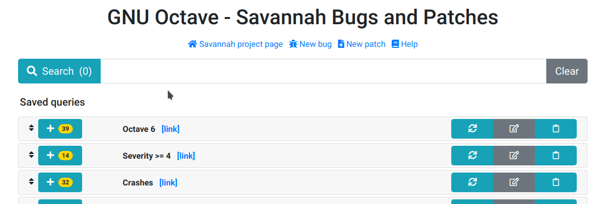
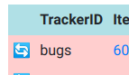
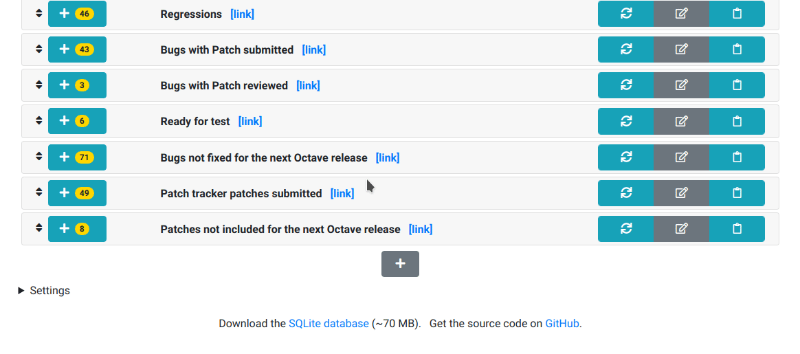
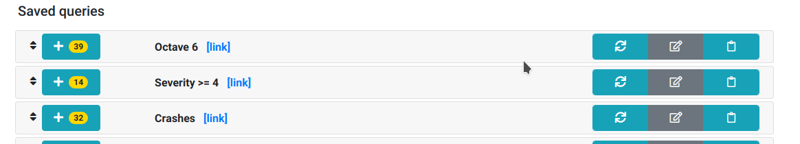
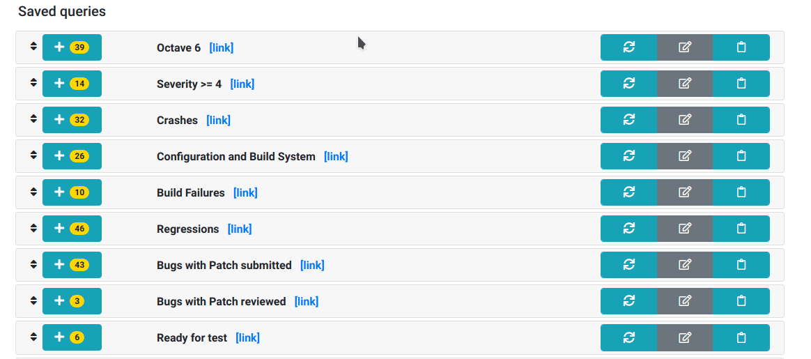
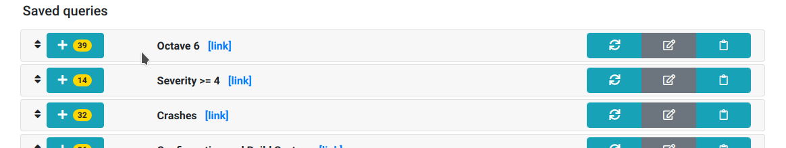
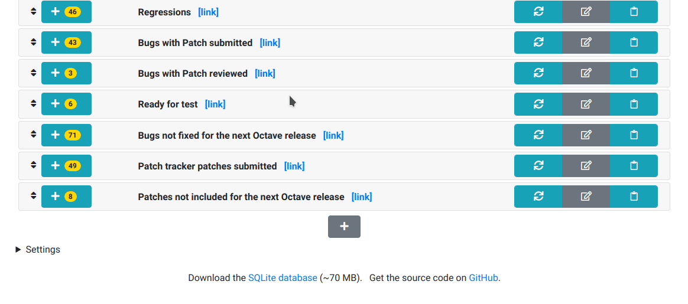
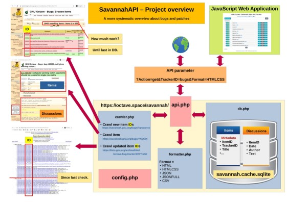

# SavannahAPI

A more systematic overview about bugs and patches

> <https://octave.space/savannah/>


## Usage

### Top search bar



Works as any other "usual" search bar:

- Enter keywords and then hit enter or press the left search button.

- The right clear button clears all fields.

- **Simple keywords as search queries** are matched with the Title and
  Discussion texts of all items (bugs and patches).

- **White space separated words** are treated as a single search term.

  For example, `"krylov subspace"` will look for Title and Discussion text
  containing both words in this order.

  The search result is likely different from `"subspace krylov"`.

- **White space matters:** `"krylov subspace"` and `"krylov  subspace"`
  (with two spaces) are different search queries.

- **Commas** are treated as logical "OR"-operator.
  For example,
  `"krylov,subspace"` and `"subspace,krylov"` are identical search queries.
  Title and Discussion texts containing either "krylov", "subspace",
  or both terms will be found.

- The top search bar also accepts **advanced API parameter search queries**,
  which are explained in the following sections.


### Synchronizing with Savannah

SavannahAPI [scrapes](https://en.wikipedia.org/wiki/Web_scraping)
periodically (every minute) the original Savannah website
and synchronizes changes.



If you are impatient or detected a synchronization error,
you can force the synchronization of a certain item by clicking on the small
blue arrow symbol at the very left of each table column in the standard
HTMLCSS output format.


### Saved queries

This section explains, how predefined queries can be modified.
Changes are stored in the local web browser cache
and remain even after closing the web browser.
The reset to the default state is explained below.

#### Create and save queries



#### Edit saved queries

> **After editing, do not forget to refresh** the results
> by clicking on the left refresh button.

Previously created saved queries can be edited and updated
by clicking the middle edit button.



If the saved query is expanded, all saved fields of the query can be edited.



#### Reorder saved queries

One can reorder the queries by drag and drop.
The drag and drop can only be done with the double arrow icon
left of the "+" button with result count.
(A fancy drag animation is missing).



#### Reset to default

By expanding the "Settings" section at the bottom of the page,
one can save, restore, and reset the web application to the default state.




## Advanced API parameter search queries

To narrow down the search results,
a **query language** of `&`-separated **key=value** pairs can be used,
which is related to an
[URL query string](https://en.wikipedia.org/wiki/Query_string).
This query language can be used to directly request data from the web API.

For example: the top bar search for `"krylov subspace"` is equivalent to
```
https://octave.space/savannah/api.php?Action=get&OrderBy=TrackerID,!ItemID&Format=HTMLCSS&Keywords=Krylov%20subspace
[ ------------ API URL ------------ ] [ ------------------------------ API parameter ----------------------------- ]
```
and can be used independently of the JavaScript client on the website.


### Octave Forge

One can create saved queries (see above) to monitor Savannah bugs
of a particular Octave Forge package or directly use the `api.php`
to create the table for embedding it into another website.

For example:
- [All bugs of the io-package](https://octave.space/savannah/api.php?Action=get&OrderBy=TrackerID,!ItemID&Format=HTMLCSS&Title=[octave%20forge]%20(io))

  `Action=get&OrderBy=TrackerID,!ItemID&Format=HTMLCSS&Title=[octave%20forge]%20(io)`
- [All **open** bugs of the io-package](https://octave.space/savannah/api.php?Action=get&OrderBy=TrackerID,!ItemID&Format=HTMLCSS&Title=[octave%20forge]%20(io)&OpenClosed=open)

  `Action=get&OrderBy=TrackerID,!ItemID&Format=HTMLCSS&Title=[octave%20forge]%20(io)&OpenClosed=open`

> As proof of concept,
> a **full Octave Forge package issue overview** can be obtained by
> importing the string "forge" ([see how](doc/forge.gif)).


### API parameter syntax and grammar

All API parameter are `key=value` pairs.

Some `value` definitions:
- `[string]`: string with white space, e.g. `"krylov  subspace"`
- `[strings]`: `[string],[string],...`, e.g. `"krylov,subspace"`
- `[int]`: non-negative integer, e.g. `1`, `42`, `12345`, ...
- `[ints]`: `[int],[int],...`, e.g. `42,12345`
- `{A|B|...}`: exactly one, e.g., `A`, `B`, ...
- `{A,B,...}`: combination, e.g., `A`, `B`, `A,B`, `B,A`, ...
- `[IGNORED]`: value ignored (reserved keyword)

Most key-value pairs allow **inverted searches** `key!=value`.  For example:
- `Category=Forge,website`:
  column "Category" contains string "Forge" **OR** string "website".
- `Category!=Forge,website`:
  column "Category" **does not** contain string "Forge" **AND** string "website".

**The key-value pair `Action=get` or `Action=update`**
**must be present in any query.**

After deciding for a query action,
the following further key-value pairs are possible:

- `Action=get`
  - `Keywords=[strings]`
  - `Title=[strings]`
  - `Category=[strings]`
  - `Severity=[strings]`
  - `Priority=[strings]`
  - `ItemGroup=[strings]`
  - `Status=[strings]`
  - `AssignedTo=[strings]`
  - `Release=[strings]`
  - `OperatingSystem=[strings]`
  - `AttachedFiles=[ints]`
  - `Limit=[int]`
  - `ItemID=[ints]`
  - `TrackerID={bugs,patch}`
  - `OpenClosed={open,closed}`
  - `Format={HTML|HTMLCSS|JSON|JSONFULL|CSV}`
  - `OrderBy={TrackerID,ItemID,Title,SubmittedOn,LastComment,Category,Severity,Priority,ItemGroup,Status,AssignedTo,OpenClosed,Release,OperatingSystem,AttachedFiles,SubmittedBy,OriginatorName}`

     The sorting order is ascending.
     If the column name has a `!` prefix, the sorting is descending.
  - `Columns={TrackerID,ItemID,Title,SubmittedOn,LastComment,Category,Severity,Priority,ItemGroup,Status,AssignedTo,OpenClosed,Release,OperatingSystem,AttachedFiles,SubmittedBy,OriginatorName,UpdateCallback}`
  - `LastComment=[IGNORED]`
  - `SubmittedOn=[IGNORED]`
- `Action=update`
  - `TrackerID={bugs,patch}`
  - `ItemID=[ints]`


## Development and deployment

[](https://raw.githubusercontent.com/gnu-octave/SavannahAPI/main/doc/project_overview.jpg)

This project is developed for the needs of the
[GNU Octave project](https://savannah.gnu.org/bugs/?group=octave).

With moderate effort it can be adapted to other GNU Savannah projects as well.

Despite a hopefully more intuitive interface,
this project can additionally be used as data exporter,
if one wants to migrate away from GNU Savannah bug trackers,
for example.

To deploy this project on your web server,
clone or copy all files of this repository,
which permits:
1. execution of PHP scripts.
   (There are currently no known issues about specific PHP versions.)
2. creation of a SQLite cache file `savannah.cache.sqlite`.

### Configuration

The server can be configured by `server/config.php`.

The JavaScript client can be configured by `client/config.js`.

### First run

After a successful deployment,
the data from Savannah has to be crawled to the local database
e.g. `savannah.cache.sqlite`.

To facilitate this task, execute the script `server/firstrun.php`
directly on your web server, e.g.
```
php firstrun.php 2>&1 | tee firstrun.log.txt
```
It requires to find an (empty) file called `FIRSTRUN` in the current
directory for protection of misuse.
Create and delete this file with:
```
touch FIRSTRUN
rm -f FIRSTRUN
```

### Keeping the server in sync with Savannah

Create for example a [cron job](https://en.wikipedia.org/wiki/Cron),
that periodically triggers an API update query, e.g.
```
https://octave.space/savannah/api.php?Action=update
```

